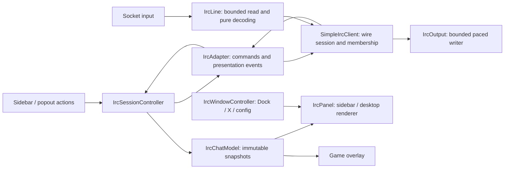

# IRC state and presentation

`IrcSessionController` owns session replacement and routes application actions. All application
model mutations run on the Swing EDT; socket reads and writes remain on the session workers.
Replacing a connection invalidates the old generation before waiting for transport closure.
Registration, accepted nick changes, and channel-state events update the model before their
human-readable messages are presented. The wire client retains protocol bookkeeping, including
confirmed membership, registration negotiation, NAMES transactions, and desired rejoin keys.

`IrcChatModel` owns conversations with stable IDs, bounded message history, drafts per
conversation, unread markers, selection, rosters, connection status, and channel status. It
publishes immutable snapshots; unchanged history lists are reused. The panel's HTML and Swing
components are render caches. The overlay reads the same model without accessing Swing widgets.
Closing a channel records the user's intent: late messages and roster replies cannot recreate it.
An explicit Join reopens it. Converging private-message nicknames merge history and preserve both
drafts. Model and protocol names use the same IRC case-mapping implementation.

Channel states are Waiting, Joining, Joined, Leaving, Failed, Kicked, and Offline. Requested
channels are separate from confirmed membership. Unsent JOIN commands have cancellable keys;
PART bypasses the ordinary command backlog so a full chat queue cannot prevent leaving. A JOIN
already being written cannot be recalled: PART follows it, while the closed conversation stays
closed. Rejoining is explicit; kicks do not trigger an automatic rejoin loop.

`IrcWindowController` is the common transition path for config, Dock, and X. It selects the host;
`IrcPanelWindow` moves the existing content and manages native window geometry/listeners. Neither
owns IRC membership or history. The sidebar and popout share the same status strip and model.

`IrcLine` parses wire messages without side effects and bounds incoming lines before an entire
unbounded line can be allocated. `IrcAdapter` remains the presentation translator for IRC events,
notice filtering, and channel-list/key dialogs. It does not decide reconnect policy.

## Reference lessons

The local reference demonstrates intended channels versus actual membership, requested
versus accepted nicknames, queued processing, separate immediate/scheduled output, and channel
snapshots. Those concepts inform this design. No dependency or source is imported; the
plugin continues to use its own implementation and existing build dependencies.

## Validation and remaining boundaries

Regression tests cover model ownership, immutable snapshots, history limits, independent drafts,
nickname merges, late replies after close, duplicate Reload requests, retained nick/key/draft
state, cancelled JOINs on a loopback socket, bounded decoding, and both native window hosts.

This refactor does not claim full IRC feature coverage. The existing fixed output pacing,
registration behavior, and manual reconnect policy remain. Additional work can independently
address stalled-write timeouts and abandoned NAMES transactions within the wire layer. Live
testing against the intended IRC network remains necessary.
